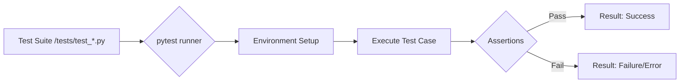

# Testing Guide

This guide describes how to maintain and verify the integrity of the `easy_strings`, `easy_math`, and `easy_json` modules through the project's testing framework.

## Overview

The library uses `pytest` to ensure component reliability. Each `easy_*` module has a corresponding test suite in the `/tests/` directory:

- `easy_json` → `/tests/test_json.py`
- `easy_math` → `/tests/test_math.py`
- `easy_strings` → `/tests/test_strings.py`

## Running Tests

Tests are executed from the project root using `pytest`.

### Execution Flow

The test execution process involves environment preparation, test runner invocation, and result reporting.



### Commands

*   **Run all tests:**
    ```bash
    pytest
    ```
*   **Run a specific module:**
    ```bash
    pytest tests/test_json.py
    ```
*   **Run a specific test function:**
    ```bash
    pytest tests/test_json.py -k "test_name"
    ```

## Testing Approach

To ensure consistent quality across `easy_*` modules, developers must adhere to the following testing standards:

1.  **Isolation**: Use `pytest` fixtures (e.g., `tmp_path`) for any operations involving the filesystem to prevent side effects.
2.  **Edge Cases**: Modules must be tested against empty inputs, invalid types, and extreme values (e.g., very large numbers in `easy_math` or malformed JSON strings).
3.  **Exception Handling**: Verify that modules raise appropriate domain-specific errors (e.g., `EasyJsonError`) rather than generic system exceptions when inputs are invalid.
4.  **Parameterization**: Use `@pytest.mark.parametrize` to test multiple inputs efficiently.

## Verifying Changes

When modifying `easy_*` code:
1.  Run the corresponding test file to ensure existing functionality is preserved.
2.  Add new test cases to cover any new features or bug fixes.
3.  Verify that all tests pass before submitting changes.
4.  If a test fails, examine the traceback to determine if the logic error is in the utility or if the test expectations need adjustment.
